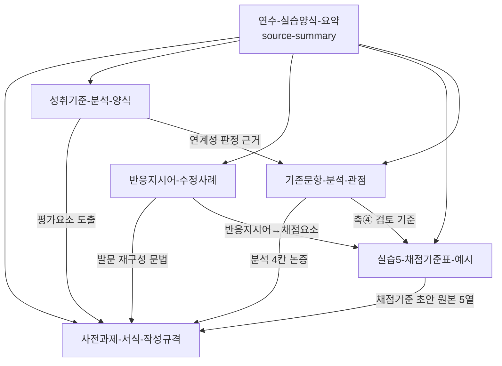

# index 초안 조각 — 실습 양식 · 사전과제 작성 규격 계열

> wiki compile 3/3 산출물. `wiki/index.md`는 건드리지 않았다. 아래 블록을 그대로 `index.md`에 붙여 넣으면 된다.

```markdown
## 실습 양식 · 사전과제 작성 규격
- [[사전과제-서식-작성규격]] -- HWPX 서식 표1~표5 칸별 작성 규격. 채점 기준 초안 2칸(평가요소/채점기준)에 표준 5열 채점기준표를 압축해 담는 서식 포함 (2026-07-27)
- [[반응지시어-수정사례]] -- 실습3의 정의 보완 11건 전수 + 전북 p.56→p.81 발문 개선 사례 + 유리수·순환소수 단원 발문 수정 세트 (2026-07-27)
- [[실습5-채점기준표-예시]] -- 실습5 5열 컬럼 구조(문항/평가요소/채점요소/수행수준/배점)와 시트 `고`·`중` 완성 예시 전문 재현 (2026-07-27)
- [[성취기준-분석-양식]] -- 실습1의 4단계 활동(색칠→3범주 정리→위계 분석→평가요소 도출)과 [9수01-06] 적용 예시 (2026-07-27)
- [[기존문항-분석-관점]] -- 서식 4개 분석 요소의 논증 근거. 학생 사고 수준은 성취수준 A~E / 계산·이해·추론·정당화 / Bloom / DOK 4틀로 진술 (2026-07-27)
- [[연수-실습양식-요약]] -- source-summary: 실습양식 7종 전 시트 덤프 + 전북 연수자료(85쪽)의 규격 계열 요약 (2026-07-27)
```

## 페이지 간 링크 구조



## 사전과제 서식 → 참조 페이지 라우팅

| 서식 칸 | 먼저 읽을 페이지 |
|---|---|
| [표1] 인적사항 | [[사전과제-서식-작성규격]] §2 |
| [표2] 평가 유형 / 관련 단원 / 성취기준 / 기존 평가 문항 | [[사전과제-서식-작성규격]] §3, [[성취기준-분석-양식]] §4-1 |
| [표3] 성취기준 연계성 | [[기존문항-분석-관점]] §1 |
| [표3] 학생 사고 수준 | [[기존문항-분석-관점]] §2 |
| [표3] 학생 응답 특성 | [[기존문항-분석-관점]] §3 |
| [표3] 개선 필요 요소 | [[기존문항-분석-관점]] §4 |
| [표4] 개선 방향 | [[사전과제-서식-작성규격]] §5-1 |
| [표4] 서·논술형 평가 문항 재구성 | [[반응지시어-수정사례]] §8·§9, [[사전과제-서식-작성규격]] §5-2 |
| [표4] 채점 기준 초안 — 평가 요소 | [[사전과제-서식-작성규격]] §5-3(1), [[성취기준-분석-양식]] §4 활동4 |
| [표4] 채점 기준 초안 — 채점 기준 | [[사전과제-서식-작성규격]] §5-3(2), [[실습5-채점기준표-예시]] §4·§7 |
| [표5] 집합연수 요청 사항 | [[사전과제-서식-작성규격]] §6, [[연수-실습양식-요약]] §3 |

## Sources

- [[연수-실습양식-요약]]
